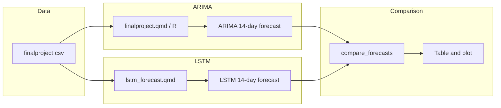

# Week 4–5 Assignment: Methods, Data, Implementation, and ARIMA vs LSTM Comparison

## Assignment context

The deliverable is a single PDF report per [week4_5.md](c:\src\my\uwf-idc6940-capstone\docs\hw4-5\week4_5.md) with: **Expanded Methods** (30%), **Dataset and loading** (25%), **Implementation and testing** (35%), and **Clarity** (10%). The report must use the suggested structure (Project Goal, Expanded Methods, Dataset and Access, Implementation and Experiments, Results, Issues/Limitations, Next Steps).

Your Methods section will have **two parts**: (1) methods from the prior ARIMA work (STA6856 final project), and (2) a new LSTM forecasting method, followed by a **comparison** of the two.

**Prior ARIMA work (excerpts, no citation):** The STA6856 final project report is not officially published. The capstone report will **include relevant excerpts** from that work (problem definition, data description, ARIMA methodology, preprocessing, forecast table/figure) in the Methods, Dataset, Implementation, and Results sections—but will **not cite or explicitly mention** the STA6856 report in the body or bibliography. Present the ARIMA content in the capstone narrative as your own methods/results; do not cite the prior report.

**Document placement:** Report, data copy, and outputs go in [docs/hw4-5](c:\src\my\uwf-idc6940-capstone\docs\hw4-5). LSTM and comparison code live in the capstone repo root [code/](c:\src\my\uwf-idc6940-capstone\code). This plan is saved in docs/hw4-5 for reference.

---

## 1. Report location and structure

- **Report file:** Create the main report in the capstone repo, e.g. `docs/hw4-5/week4_5_report.tex` (or use [CapstoneProject_template.tex](c:\src\my\uwf-idc6940-capstone\docs\project-template\CapstoneProject_template.tex) as a base if you prefer the full capstone template). The assignment asks for a single PDF; export from this document.
- **Sections to include (from assignment):**
  - **1. Project Goal and Research Question** — Trip duration forecasting for NYC Uber daily averages; compare time-series (ARIMA) vs LSTM.
  - **2. Expanded Methods** — Two subsections (see below) plus a short “Comparison plan” subsection.
  - **3. Dataset and Access** — NYC TLC FHV data, daily averages, source/citation, and proof of load (dimensions, variables, missingness).
  - **4. Implementation and Experiments** — What was implemented, what was tested, what worked/did not, preliminary outputs.
  - **5. Results (preliminary)** — Metrics and figures for ARIMA, LSTM, and comparison.
  - **6. Issues / Limitations**
  - **7. Next Steps**
- **Code appendix / GitHub:** Either a short code appendix in the report or a clear GitHub link to the code (assignment allows either).

---

## 2. Expanded Methods — Part 1: ARIMA (prior work, use excerpts only)

**Include relevant excerpts** from the prior ARIMA work in the capstone Methods section. Do not cite or name the prior report (it is not officially published). Present the following content in the narrative as the capstone’s own methodology; the prior report and code remain internal references only (e.g. [finalproject-report.tex](c:\src\my\uwf-sta6856\finalproject\docs\finalproject-report.tex), [finalproject.qmd](c:\src\my\uwf-sta6856\finalproject\code\finalproject.qmd)).

**Content to incorporate as excerpts (no citation of prior report):**

- **Problem:** Forecast daily average Uber trip duration (minutes) in NYC; univariate time series; output = 14-day point forecast and intervals.
- **Data (initial):** Daily average trip duration for 2024 (366 days); derived from NYC TLC FHV data via PySpark (filter Uber HV0003, clean duration/miles/speed, IQR-based outlier removal, aggregate by `pickup_date`). Final series: `pickup_date`, `avg_duration_min`.
- **Preprocessing (for modeling):** Load CSV in R; form `ts(..., frequency=366)`; optional first differencing for stationarity.
- **Modeling:** Stationarity (ADF); ACF/PACF; candidate ARIMA(1,1,1), (2,1,1), (3,1,2); selection by AIC/BIC; residual diagnostics (Ljung–Box, ACF of residuals). Selected model: **ARIMA(3,1,2)**. Forecast: 14-day horizon with 80% and 95% intervals.
- **Evaluation (for later comparison):** Same horizon (14 days) and same metrics (sMAPE and MASE) as for LSTM on the same test period.

Keep Part 1 concise (about one to two pages when written); present the ARIMA methodology in the capstone narrative without citing the prior report.

---

## 3. Expanded Methods — Part 2: LSTM forecasting (new)

Describe the LSTM approach you will implement for the **same** target (daily average trip duration) and **same** forecast horizon (e.g., 14 days) so that comparison is fair.

**Suggested content (to be implemented in code):**

- **Problem:** Same as ARIMA — predict next 14 days of daily average trip duration (univariate or with minimal features, e.g. day-of-week).
- **Data:** Same series as ARIMA: `finalproject.csv` (pickup_date, avg_duration_min). No extra datasets required.
- **Preprocessing:**
  - Train/validation/test split (e.g. chronological: e.g. last 14 days as test, preceding N for validation, rest for train).
  - Scaling: e.g. MinMaxScaler or StandardScaler on training segment only; apply same transform to validation and test.
  - Sequence construction: sliding window of length `L` (e.g. 14–30 days) to predict next 1 or next 14 steps; define exactly how multi-step is done (e.g. recursive 1-step vs direct 14-step or hybrid).
- **Model:** LSTM architecture — e.g. 1–2 LSTM layers, units per layer, optional dropout; dense output for 1-step or 14-step. Framework: TensorFlow/Keras or PyTorch.
- **Training:** Loss (e.g. MSE), optimizer, epochs, batch size, early stopping on validation loss; no test data in training.
- **Forecasting:** Procedure to produce 14-day forecast (e.g. recursive from last known date, or direct 14-step if model outputs 14 values). Use same end date as ARIMA for comparability.
- **Evaluation:** Same metrics as comparison plan (sMAPE and MASE over the 14-day test window).

Write this as a “modeling/analysis plan” in the report first; then implement it in code and report what was actually done in Section 4.

---

## 4. Comparison plan (subsection under Expanded Methods)

- **Same target variable:** Daily average trip duration (minutes).
- **Same dataset:** [finalproject.csv](c:\src\my\uwf-sta6856\finalproject\data\finalproject.csv) (366 days).
- **Same forecast horizon:** 14 days (align test period so both models forecast the same dates).
- **Metrics:** sMAPE and MASE over the 14-day forecast (as in [hw3.tex](c:\src\my\uwf-idc6940-capstone\docs\hw3\hw3.tex) literature).
- **Presentation:** One table (ARIMA vs LSTM: sMAPE, MASE) and one figure (e.g. actual vs ARIMA vs LSTM over the 14 days). Short discussion of which method performed better and why (e.g. sample size, seasonality, overfitting).

---

## Clarification: LSTM data and sample size

- **LSTM uses the same 366 data points** as ARIMA: the daily series in [finalproject.csv](c:\src\my\uwf-sta6856\finalproject\data\finalproject.csv) (one row per day for 2024). No additional data are used for the LSTM.
- **Is 366 sufficient?** Yes for this assignment: it is enough to train a small LSTM, produce a 14-day forecast, and compare to ARIMA on sMAPE and MASE. Many time-series comparison studies use a few hundred observations.
- **Limitation:** 366 observations is on the small side for deep learning. After a chronological train/validation/test split (e.g. last 14 days test, some validation, rest train), the LSTM may have only a few hundred training sequences. This increases overfitting risk and may favor the simpler ARIMA model.
- **Practical approach:** Use a **parsimonious** LSTM (e.g. one LSTM layer, modest units, dropout, early stopping). In the report, state explicitly that both methods use the same 366 points and that **small sample size** is a limitation; mention it in **Issues / Limitations** and **Next Steps** (e.g. extending with more years of data if available).

---

## 5. Dataset and Access (Section 3)

- **Source:** NYC TLC High-Volume FHV data (cite NYC TLC only, e.g. \cite{nyctlc2024}). The **analysis-ready** dataset is the daily time series: `finalproject.csv` (daily average trip duration for 2024). Describe data production (e.g. PySpark aggregation to daily averages) in the narrative using a short excerpt; do not cite the prior report.
- **Proof of load:** In the report, include (or reference from implementation):
  - Dimensions (e.g. 366 rows × 2 columns).
  - Variable names and types (`pickup_date`, `avg_duration_min`).
  - Missing values (if any).
- **Access:** Describe where the series comes from (e.g. aggregated from NYC TLC FHV data; CSV in repo or copy in `docs/hw4-5/data/finalproject.csv`). No citation of the prior report.

---

## 6. Implementation and experiments (Section 4)

- **ARIMA:**  
  - Reproduce the 14-day ARIMA forecast using existing R/Quarto code ([finalproject.qmd](c:\src\my\uwf-sta6856\finalproject\code\finalproject.qmd)).  
  - In the capstone report: describe what you ran and which dataset/subset (full 2024 → 14-day forecast from end). **Include excerpts** of the ARIMA forecast table and/or figure in the report narrative; do not cite the prior report.

- **LSTM:**  
  - Implementation in the **capstone** repo under [code/](c:\src\my\uwf-idc6940-capstone\code): [lstm_forecast.qmd](c:\src\my\uwf-idc6940-capstone\code\lstm_forecast.qmd) (R/keras + ggplot2). Same ggplot2 style as [finalproject.qmd](c:\src\my\uwf-sta6856\finalproject\code\finalproject.qmd): theme_minimal(), scale_x_date, labs.  
  - Loads `finalproject.csv`, train/val/test split, scaling, sequences, LSTM training, 14-day forecast, sMAPE/MASE; produces publication-ready figures.  
  - Document: library (keras in R), sequence length (e.g. 21), architecture (one LSTM layer, 32 units, dropout, early stopping), and recursive 1-step 14-day forecast.  
  - Report what worked and what did not (e.g. overfitting, need for more data, hyperparameters).

- **Comparison:**  
  - Script or notebook that: (1) reads ARIMA 14-day forecast (from R output or saved CSV), (2) reads LSTM 14-day forecast, (3) reads actuals for the same 14 days (if available), (4) computes sMAPE and MASE for both (MASE uses naive one-step MAE on training data as scale), (5) produces comparison table and plot. If actuals for future dates are not available, state that comparison is on a held-out period within 2024 (e.g. last 14 days of 2024 as “test”) and report metrics accordingly.

---

## 7. Results (Section 5)

- **Preliminary outputs:**  
  - ARIMA: 14-day forecast table and figure **included as excerpts** in the capstone report (no citation of prior report).  
  - LSTM: 14-day forecast figure; training/validation loss curve from [lstm_forecast.qmd](c:\src\my\uwf-idc6940-capstone\code\lstm_forecast.qmd) (ggplot2, same style as finalproject.qmd).  
  - Comparison: table (ARIMA vs LSTM — sMAPE, MASE); figure (actual vs both forecasts over the same 14 days).
- **Short interpretation:** Which method did better on the chosen metrics; possible reasons (e.g. LSTM capturing nonlinearity vs ARIMA stability with small data).

---

## 8. Suggested file layout

- **Report and assignment docs** in [docs/hw4-5](c:\src\my\uwf-idc6940-capstone\docs\hw4-5):

```text
docs/hw4-5/
  hw4-5_methods_and_lstm_comparison_c042d4ff.plan.md   # this plan (saved here)
  week4_5.md                                            # assignment (existing)
  week4_5_report.tex                                   # main report (new)
  week4_5_report.pdf                                   # export for submission
  data/
    finalproject.csv                                    # optional copy from STA6856 for self-contained run
    lstm_forecast_14day.csv                             # output from LSTM pipeline for comparison
  images/                                               # optional: figures for report (e.g. comparison plot)
```

- **LSTM and comparison code** in capstone repo root [code/](c:\src\my\uwf-idc6940-capstone\code):

```text
code/
  lstm_forecast.qmd                                     # LSTM pipeline (R/keras + ggplot2); report figures from here
  compare_forecasts.py                                  # or .ipynb — load ARIMA + LSTM outputs, compute sMAPE/MASE, plot
```

ARIMA code stays in the STA6856 repo; the report references it and optionally includes a short appendix or link. LSTM implementation and figures: [lstm_forecast.qmd](c:\src\my\uwf-idc6940-capstone\code\lstm_forecast.qmd) only.

---

## 9. Dependency and data flow



---

## 10. Checklist before submission

- [ ] Report has all seven sections from the assignment.
- [ ] Expanded Methods clearly has Part 1 (ARIMA, using excerpts from prior work; no citation of prior report), Part 2 (LSTM), and comparison plan.
- [ ] Dataset section cites source and shows load proof (dimensions, variables, missing).
- [ ] ARIMA results come from running STA6856 code; LSTM results from new capstone code.
- [ ] Same 14-day horizon and same metrics (sMAPE, MASE) for both methods.
- [ ] Comparison table and figure included; Issues/Limitations and Next Steps filled (include small sample size for LSTM as a limitation).
- [ ] Code appendix or GitHub link provided; PDF exported and submitted.

This plan keeps the prior ARIMA work as the first method (presented via excerpts in the capstone report, without citing the unpublished prior report), adds LSTM as the second, and aligns both on data, horizon, and metrics so the comparison is clear and gradable.