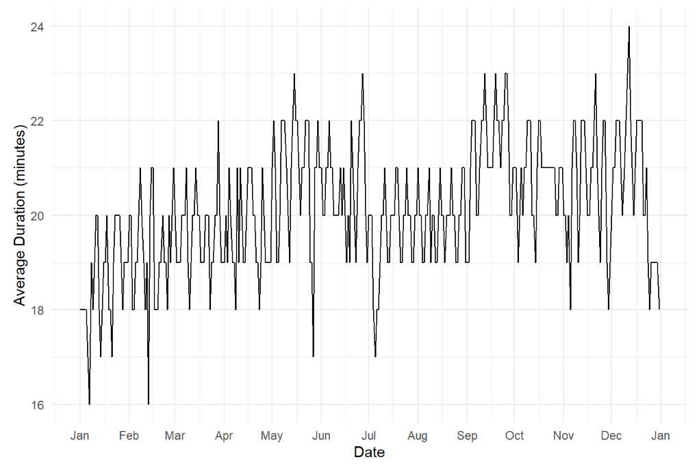
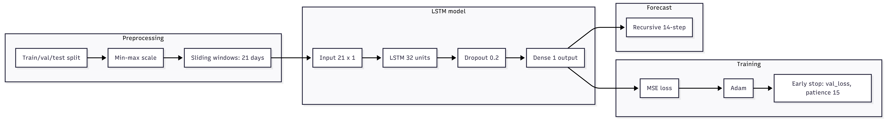
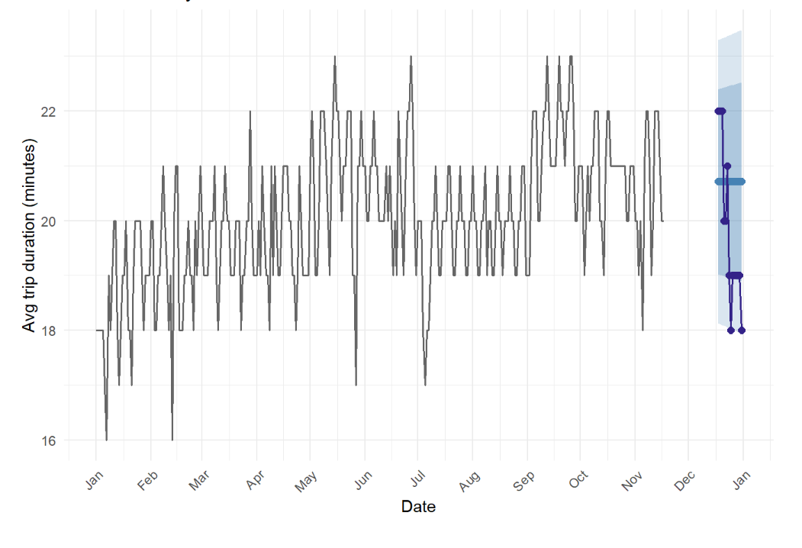
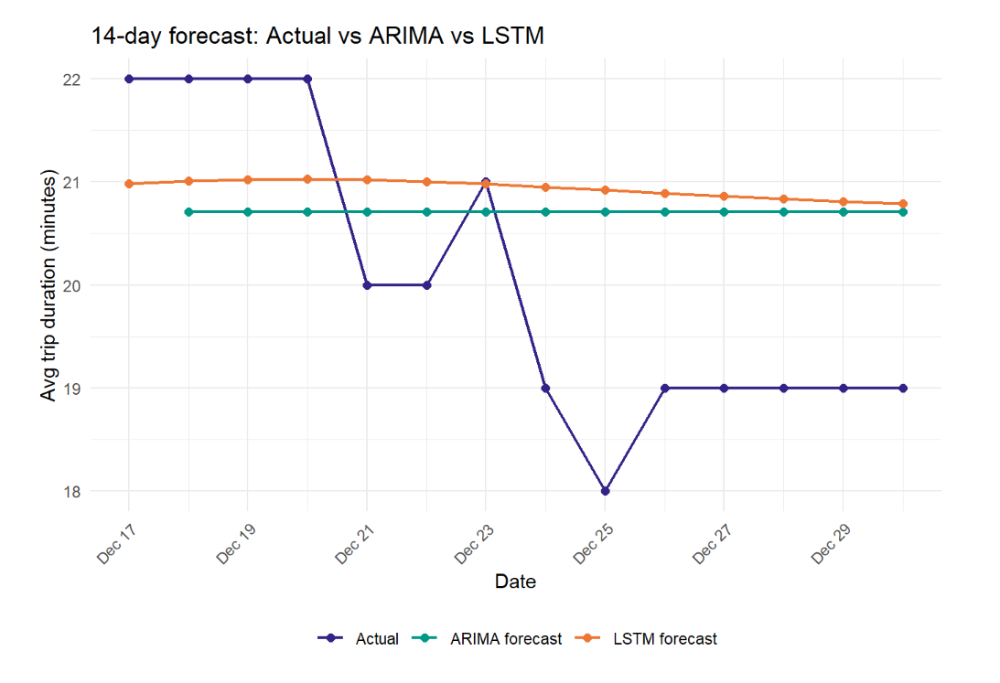
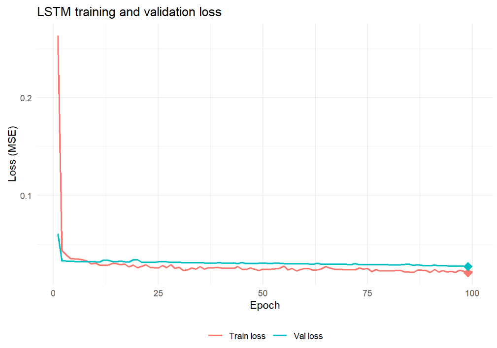

<!-- _class: title-slide -->

<!--
SLIDE 1 SCRIPT (~30 seconds):
"Good [morning/afternoon/evening] everyone. Thank you for joining today. My name is Farooq Mahmud,
and this is my capstone presentation for IDC 6940. The project is titled 'Comparing ARIMA and LSTM
for Short-Term Forecasting of Daily Average Uber Trip Duration in New York City.' Over the next 20
minutes I'll walk you through the motivation, the methods, the implementation, the results, and
what I learned from this project. Let's get started."
-->

# Comparing ARIMA and LSTM for Short-Term Forecasting of Daily Average Uber Trip Duration in NYC

**Farooq Mahmud**
IDC 6940 — Capstone
University of West Florida

March 2026

---

<!--
SLIDE 2 SCRIPT (~30 seconds):
"Here's a quick roadmap of the presentation. We'll start with the problem and why it matters,
then move through the data, the two models, the implementation experience, the results, and
close with the conclusions and future directions. I'll try to be as concrete as possible
so you can see exactly what was done at each stage."
-->

# Agenda

1. **Background & Motivation** — Why this problem matters
2. **Data** — NYC TLC High-Volume FHV data
3. **Mathematical Framework** — ARIMA and LSTM models
4. **Experimental Design** — Train / validation / test split & metrics
5. **Code & Implementation** — Sources, challenges, accomplishments
6. **Results** — Forecasts and metric comparison
7. **Conclusion & Future Work**

---

<!--
SLIDE 3 SCRIPT (~1 minute):
"The central question driving this capstone is straightforward: for a short-horizon, univariate
time series, does a classical statistical model—ARIMA—outperform a neural sequence model—LSTM?
This question matters in practice. If you're an operations manager at Uber trying to schedule
drivers two weeks out, you need a reliable forecast. You also need to know whether it's worth
the additional complexity of a deep learning model, or whether a simpler classical approach
gives you equally good—or even better—results.

The specific target variable is the daily average Uber trip duration in minutes in New York City.
We have 366 daily observations for the full year 2024, and we produce a 14-day ahead forecast
with both methods, evaluated on the same test window using two well-established metrics:
sMAPE and MASE."
-->

# The Research Question

> **How do ARIMA and LSTM forecasting methods compare for 14-day forecasting of daily average Uber trip duration in New York City when evaluated on sMAPE and MASE?**

### Why it matters

- Operational planning: driver scheduling, surge pricing, fleet management
- Classical vs. neural: is extra complexity worth it for short horizons?
- Practical benchmark on a real-world urban-mobility time series

### Scope

| Item | Detail |
|---|---|
| **Target variable** | Daily average Uber trip duration (minutes) |
| **Data** | 366 daily observations, full year 2024 |
| **Forecast horizon** | 14 days |
| **Evaluation** | sMAPE and MASE on the same test window |

---

<!--
SLIDE 4 SCRIPT (~1.5 minutes):
"Let me give a bit more background. Time-series forecasting sits at the heart of statistics and
data science. ARIMA—AutoRegressive Integrated Moving Average—has been the workhorse of
univariate forecasting for decades. It's interpretable, well-understood, and performs
surprisingly well on datasets where the underlying dynamics are relatively simple.

LSTM networks, which are a type of recurrent neural network designed by Hochreiter and
Schmidhuber in 1997, were built specifically to capture long-range temporal dependencies
that vanilla RNNs struggle with because of the vanishing gradient problem. They have become
extremely popular for time-series tasks ranging from financial forecasting to natural language
processing.

The open question this project addresses is whether LSTM's added modeling power is actually
beneficial when you have a relatively small dataset—366 observations—and a univariate setting.
Comparative studies in the literature, like the one cited by Prabhat et al. 2024, show mixed
results and motivate exactly this kind of direct, reproducible comparison."
-->

# Background & Motivation

### Classical: ARIMA
- Decades of proven performance on univariate time series
- Interpretable parameters: autoregressive, differencing, moving-average orders
- Model selection via AIC and BIC; stationarity tested with ADF

### Neural: LSTM
- Hochreiter & Schmidhuber (1997) — solves the vanishing gradient problem
- Memory cells with forget, input, and output gates capture long-range dependencies
- Increasingly popular for financial, weather, and transportation forecasting

### The gap this project fills
- Direct, reproducible comparison on the **same** real-world urban-mobility series
- Same training data, same test window, same evaluation metrics
- Small dataset (366 obs): does deep learning help or hurt?

> Prior comparative studies (Prabhat et al., 2024) show mixed results — this project provides a concrete, controlled benchmark.

---

<!--
SLIDE 5 SCRIPT (~1.5 minutes):
"The data come from the New York City Taxi and Limousine Commission, which publishes monthly
parquet files of every High-Volume For-Hire Vehicle trip in New York City. The raw dataset
for 2024 contains over 200 million trip records. Of those, about 179 million belong to Uber,
identified by the license code HV0003.

The preprocessing was done in PySpark running on Google Colab, because the raw files are
simply too large to process on a laptop. After filtering to Uber trips, I derived two new
columns—trip duration in minutes and average speed in miles per hour. I then applied a
two-step outlier removal: first basic range filters to remove physically impossible trips
such as a zero-minute duration or a 200-mile ride, and then an IQR-based filter to remove
statistical outliers. After all of that, about 159 million rows remained, which were
aggregated to a single CSV file with 366 rows—one row per day—containing the date and the
mean trip duration for that day."
-->

# Data: NYC TLC High-Volume FHV

### Source
NYC Taxi & Limousine Commission — High-Volume FHV Trip Records (2024)
[data.nyc.gov](https://www.nyc.gov/site/tlc/about/tlc-trip-record-data.page)

### Scale of raw data
| Stage | Row count |
|---|---|
| All HVFHV records | ~200 million |
| After Uber filter (`HV0003`) | ~179 million |
| After outlier removal | ~159 million |
| **Final time series** | **366 rows (1 per day)** |

### Preprocessing pipeline (PySpark on Google Colab)
1. Filter to Uber (`hvfhs_license_num == "HV0003"`)
2. Derive `trip_duration_min` and `avg_speed_mph`
3. Range filters: duration 1–120 min, distance 0.1–100 mi, speed 1–80 mph
4. IQR-based outlier removal using `approxQuantile`
5. Group by date → mean duration per day → write to CSV

---

<!--
SLIDE 6 SCRIPT (~1 minute):
"Here's what the final time series looks like. You can see 366 points running from January
through December 2024. There's a clear seasonal pattern—trip durations tend to be longer on
weekdays than on weekends, and there are dips around major holidays. The December 25 dip is
particularly visible. The series is relatively smooth and stationary-looking, which is
actually a favorable property for ARIMA. For LSTM, the weekly oscillation gives the model
a repeating pattern to learn."
-->

# The Time Series



- **366 daily observations**, January 1 – December 31, 2024
- Visible **weekly seasonality**: weekday trips longer than weekend trips
- Holiday dips visible (New Year's, July 4th, Thanksgiving, Christmas)
- Series is relatively stationary — favorable for ARIMA

---

<!--
SLIDE 7 SCRIPT (~2 minutes):
"Now let me walk through the mathematics. ARIMA stands for AutoRegressive Integrated Moving
Average. The general form is ARIMA(p, d, q). After d rounds of differencing to achieve
stationarity, the model expresses the current value as a linear combination of the p most
recent past values—that's the autoregressive part—plus a linear combination of the q most
recent forecast errors—that's the moving average part—plus white noise.

The R forecast package's auto.arima function automates model selection. It first runs the
Augmented Dickey-Fuller test to determine how many rounds of differencing are needed, then
searches over combinations of p and q, selecting the one that minimizes AIC and BIC.

In this project, auto.arima selected ARIMA(1, 1, 4). That means: one differencing step to
remove the trend and achieve stationarity, an autoregressive term that depends on the most
recent observation, and four moving-average terms that incorporate forecast errors from the
last four time steps. Intuitively, the MA(4) terms help the model recover quickly from
short-term anomalies like an unusual traffic event."
-->

# Mathematical Framework: ARIMA

### ARIMA(p, d, q)

$$\phi(B)(1-B)^d y_t = \theta(B)\varepsilon_t$$

| Symbol | Meaning |
|---|---|
| $B$ | Backshift operator: $By_t = y_{t-1}$ |
| $d$ | Differencing order (achieves stationarity) |
| $\phi(B)$ | AR polynomial of order $p$ |
| $\theta(B)$ | MA polynomial of order $q$ |
| $\varepsilon_t$ | White noise |

### Model selected: ARIMA(1, 1, 4)
- **d = 1**: One round of differencing removes trend → stationarity
- **p = 1**: Prediction depends on the most recent observation
- **q = 4**: Corrections based on forecast errors from the last 4 days
- Selected automatically by `auto.arima` using **AIC and BIC minimization**

---

<!--
SLIDE 8 SCRIPT (~2 minutes):
"The second model is an LSTM network implemented in R using the Keras package. Let me
describe the architecture. The input to the model is a 3-dimensional array: samples,
time steps, and features. Here, features is just 1 since this is a univariate series.

The time steps dimension is the sequence length, which I set to 21 days. I chose 21
because the series shows weekly cycles—weekdays and weekends behave differently. With
three weeks of context, the LSTM sees three full repetitions of the weekly pattern,
giving it enough information to recognize and extrapolate the cycle.

The model has a single LSTM layer with 32 hidden units. After the LSTM layer there's a
dropout layer with a rate of 0.2, which randomly zeros out 20% of the units during
each training step to reduce overfitting. Finally, a dense output layer with a single
neuron produces the predicted value for the next day.

The model is trained to minimize mean squared error using the Adam optimizer.
Early stopping monitors the validation loss with a patience of 15 epochs and restores
the best weights found during training.

Forecasting is done recursively: I feed the last 21-day window before the test period
to the model, predict day 1, append that prediction to the window, drop the oldest
value, and repeat 14 times to get the full 14-day forecast."
-->

# Mathematical Framework: LSTM

### Training loss (MSE)
$$\mathcal{L} = \frac{1}{N}\sum_{i=1}^{N}(y_i - \hat{y}_i)^2$$

### Architecture

| Component | Setting |
|---|---|
| Input shape | (21 time steps × 1 feature) |
| LSTM layer | 32 units |
| Dropout | rate = 0.2 |
| Dense output | 1 unit |
| Optimizer | Adam |
| Loss | MSE |
| Early stopping | patience = 15, restore best weights |

### Recursive 14-day forecast
Feed last 21-day window → predict day 1 → append → roll window → repeat 14×

---

<!--
SLIDE 9 SCRIPT (~30 seconds):
"Here's a visual of the LSTM architecture showing how data flows from the input sequence
through the LSTM layer, dropout, and into the single output neuron."
-->

# LSTM Architecture



---

<!--
SLIDE 10 SCRIPT (~1.5 minutes):
"For the experimental design, both models use the same chronological split. The last
14 days of 2024—December 18 through December 31—are held out as the test set. The
preceding 30 days form the validation set, and all remaining data is training.

This strict chronological split is essential. You must never train on future data
when evaluating a time series model, because that would leak future information and
produce artificially optimistic results.

Both models are evaluated on the exact same 14 test days using two metrics. sMAPE—
symmetric mean absolute percentage error—is scale-independent and symmetric, treating
over- and under-forecasting equally. MASE—mean absolute scaled error—benchmarks
the forecast against a naive one-step forecast on the training data. A MASE below 1
means the model beats the naive baseline; above 1 means it doesn't. Since sMAPE is
returned as a proportion by the R Metrics package, I multiply by 100 to express it
as a percentage."
-->

# Experimental Design

### Chronological data split (366 days)

```
|<--- Training: 322 days --->|<-- Validation: 30 days -->|<-- Test: 14 days -->|
 Jan 1, 2024                                               Dec 18        Dec 31
```

> No future data leaks into training — strict temporal ordering enforced.

### Evaluation metrics

**sMAPE** (symmetric mean absolute percentage error):
$$\text{sMAPE} = \frac{100\%}{n}\sum_{t=1}^{n}\frac{|y_t - \hat{y}_t|}{(|y_t| + |\hat{y}_t|)/2}$$

**MASE** (mean absolute scaled error — scaled by naive 1-step MAE on training data):
$$\text{MASE} = \frac{\text{MAE}_{\text{test}}}{\text{MAE}_{\text{naive, train}}}$$

- MASE < 1 → beats naive baseline &nbsp;|&nbsp; MASE > 1 → worse than naive

---

<!--
SLIDE 11 SCRIPT (~2 minutes):
"Now let me talk about the code and implementation, because this is where a lot of the
real work happened.

The code is entirely original. I did not copy from any specific GitHub repository.
The PySpark preprocessing pipeline—all the filtering, cleaning, and aggregation—I
wrote from scratch for this project, guided by the PySpark documentation and the
structure of the NYC TLC data dictionary.

The R LSTM pipeline follows well-known patterns documented in the Keras time series
tutorial and the rwanjohi LSTM-in-R repository. However, the specific combination
of the functional Keras API, custom create_sequences function, min-max scaling
closures, recursive forecasting loop, and MASE/sMAPE evaluation is original code
I wrote for this project.

I actually spent a good part of the project searching public GitHub repos to check
whether similar code existed. The conclusion was that no single public repository
contains code substantially identical to the capstone's appendix. The closest
conceptual matches are the Keras official time series tutorial—which the paper
already cites—and rwanjohi's LSTM R repo, which uses a different API style and
differencing-based preprocessing rather than sliding windows.

The biggest implementation challenge was LSTM reproducibility, which I'll talk
about on the next slide."
-->

# Code & Implementation

### Origins

| Component | Source |
|---|---|
| PySpark preprocessing | **Original** — written from scratch using PySpark docs & NYC TLC data dictionary |
| ARIMA pipeline (R) | **Original** — uses standard `forecast::auto.arima` library functions |
| LSTM pipeline (R/Keras) | **Original** — adapts documented Keras time-series patterns to R |
| ggplot2 visualization | **Original** — standard ggplot2 idioms |

### Closest public references (no code copied)
- [**rwanjohi/Time-series-forecasting-using-LSTM-in-R**](https://github.com/rwanjohi/Time-series-forecasting-using-LSTM-in-R) — similar concept, different API (sequential vs. functional) and preprocessing approach
- [**keras.io timeseries forecasting tutorial**](https://keras.io/examples/timeseries/timeseries_weather_forecasting/) — sliding-window + LSTM pattern (Python); adapted to R

### Key accomplishment
Full end-to-end reproducible pipeline: 200M-row PySpark ETL → R ARIMA → R LSTM → metric comparison

---

<!--
SLIDE 12 SCRIPT (~2 minutes):
"The single biggest challenge in the implementation was LSTM reproducibility. Unlike
ARIMA, which is a deterministic algorithm given the same data, LSTM training is
stochastic. The randomness comes from three sources: weight initialization, the
random validation split during training, and dropout during each forward pass.

I attempted to fix the random seed using TensorFlow's set_random_seed and R's
set.seed, but in our environment—R with Keras on Windows—seed fixing did not produce
consistent results across runs. The sMAPE and MASE values shifted noticeably from
run to run.

The solution I adopted was to run the LSTM pipeline five independent times and report
the mean and standard deviation of the metrics across those five runs. This gives a
statistically honest summary: you can see both the central tendency and the variability
of the LSTM's performance, which makes the comparison with the deterministic ARIMA
result much more meaningful.

A second challenge was infrastructure: running PySpark on Google Colab required
careful management of the Colab session, mounting Google Drive, and handling the
fact that Colab sessions time out. I broke the pipeline into checkpointed steps
so I could resume without reprocessing everything from scratch."
-->

# Implementation Challenges

### Challenge 1: LSTM reproducibility

- LSTM training is **stochastic**: weight initialization, random validation split, dropout
- Setting `tensorflow::set_random_seed()` and `set.seed()` did **not** produce consistent results in our R/Windows/Keras environment
- sMAPE and MASE values shifted noticeably run-to-run

**Solution:** Run LSTM 5 independent times → report **mean ± standard deviation**

### Challenge 2: PySpark scale on Colab

- 200M+ row parquet dataset — too large for local processing
- Google Colab session timeouts required checkpointing the pipeline
- IQR computation via `approxQuantile` is approximate by design — acceptable trade-off for scale

### Key accomplishments
✅ End-to-end reproducible Quarto pipelines for both models  
✅ Honest uncertainty quantification for LSTM metrics  
✅ Fair evaluation: identical test window for both models  

---

<!--
SLIDE 13 SCRIPT (~1.5 minutes):
"Let's look at the results. This plot shows the ARIMA 14-day point forecast together
with the 80% and 95% prediction intervals, compared against the actual values.

A few things to notice. First, the ARIMA forecast is quite flat. This is expected
behavior for ARIMA(1,1,4). Because the differencing term is 1, the model predicts
future changes from the current level. As we go further out, the expected change
converges to zero, so the forecast stabilizes around the recent average.

Second, most of the actual values fall within the 95% prediction interval, which
suggests the intervals are reasonably well-calibrated. A couple of points—particularly
around Christmas—fall at the edge of or outside the 80% interval, reflecting the
holiday-driven deviation that neither model anticipated."
-->

# Results: ARIMA 14-Day Forecast



- **Flat forecast**: ARIMA(1,1,4) converges toward recent average — expected behavior
- **Intervals**: Most actuals fall within 95% band — reasonable calibration
- **Christmas dip** (Dec 25) falls near the lower 80% bound — holiday effect not captured

---

<!--
SLIDE 14 SCRIPT (~2 minutes):
"Now let's compare the two models side by side. The left panel shows the 14-day
actual values in dark purple, the ARIMA forecast in teal, and the LSTM forecast in orange.

ARIMA is flat—it predicts a nearly constant value for all 14 days. LSTM is slightly
smoother with a gentle downward trend, reflecting that the network is averaging toward
the historical mean and picking up a slight downward signal in the recent data. Neither
model captured the sharp Christmas dip on December 25.

The table on the right shows the metric results. ARIMA achieved an sMAPE of 7.58%
and a MASE of 1.93. The LSTM averaged an sMAPE of 8.05% plus or minus 0.34 percentage
points, and a MASE of 2.09 plus or minus 0.09, across five independent runs.

On both metrics, ARIMA edged out LSTM. The gap is modest—less than half a percentage
point on sMAPE—but it's consistent. Both models have MASE above 1, which means
neither beats a naive one-step lag baseline on this test window. That's an honest
and important result: the 14-day holiday period at the end of the year is simply
hard to forecast with a univariate model."
-->

# Results: ARIMA vs LSTM



<div class="columns">

| Model | sMAPE (%) | MASE |
|---|---|---|
| **ARIMA** | **7.58** | **1.93** |
| LSTM | 8.05 ± 0.34 | 2.09 ± 0.09 |

</div>

- ARIMA **slightly outperforms** LSTM on both metrics
- LSTM values are mean ± SD of **5 independent runs**
- Both MASE > 1: neither beats the naive baseline on this test window
- Neither model captures the **Christmas Day dip** (Dec 25)

---

<!--
SLIDE 15 SCRIPT (~1.5 minutes):
"The LSTM training and validation loss curves both decrease quickly in early epochs and
then flatten. The diamond markers indicate the epochs where the minimum training loss
and minimum validation loss occurred. There is no sign of classic overfitting: the
validation loss does not start rising while the training loss continues to fall. Both
curves stabilize well within the 100-epoch budget, confirming that early stopping
fired appropriately and that additional epochs would not have improved the forecast."
-->

# Results: LSTM Training Convergence



- Both curves decrease quickly and **stabilize** — no overfitting
- Markers (◆) show epochs with minimum training and validation loss
- Early stopping fired before 100 epochs — budget was sufficient
- Stable convergence → poor forecast accuracy is a **data limitation**, not a training problem

---

<!--
SLIDE 16 SCRIPT (~1.5 minutes):
"So what do these results mean? A few key interpretations.

First, for a short-horizon univariate forecasting problem with only 366 training
observations, ARIMA is a strong baseline. It is deterministic, interpretable, and
runs in seconds. The LSTM, by contrast, requires careful hyperparameter tuning,
careful handling of scaling, early stopping, and multiple runs to get a stable metric
estimate. All that extra complexity yielded a slightly worse result.

Second, both models struggled with holiday effects. December 25 saw a sharp drop
in average trip duration, likely because fewer riders take longer trips on Christmas
Day. A univariate model with no calendar features simply cannot anticipate this.

Third, the LSTM's run-to-run variability—roughly ±0.34 sMAPE points—is not negligible.
When two models are separated by less than half a percentage point, that variability
matters. Reporting a single LSTM run would be misleading.

The broader takeaway is that the assumption 'deep learning is always better' does
not hold in small-data, short-horizon settings. ARIMA's simplicity is a strength
when data are limited."
-->

# Discussion & Interpretation

### Why ARIMA performed similarly to (or better than) LSTM

| Factor | Impact |
|---|---|
| **Small dataset** (366 obs, ~280 training) | Limits LSTM learning capacity |
| **Univariate** — no external features | Both models blind to holidays/weather |
| **Short horizon** (14 days) | ARIMA's flat forecast surprisingly competitive |
| **Stable dynamics** | Simple AR + MA structure sufficient |

### What neither model could do
- Capture the **Christmas Day anomaly** (Dec 25 sharp dip)
- Adapt to holiday calendar effects without additional covariates

### Key insight
> The assumption that "deep learning is always better" does **not** hold in small-data, short-horizon settings. ARIMA's simplicity is a strength when data are limited.

---

<!--
SLIDE 17 SCRIPT (~1 minute):
"Let me summarize the conclusions. The capstone set out to answer a concrete question:
ARIMA or LSTM for 14-day forecasting of daily Uber trip duration? The answer is that
ARIMA performed slightly better on sMAPE and MASE in this controlled experiment.

The work contributes a fully reproducible pipeline—from a 200-million-row PySpark ETL
all the way through to metric evaluation—that others can replicate and extend. The honest
reporting of LSTM variability across five runs adds statistical rigor that a single
reported run would lack.

The result is not a blanket endorsement of ARIMA over neural networks. It's a concrete,
data-driven demonstration that in the right conditions—small sample, univariate,
short horizon—classical methods remain competitive. Choosing the right tool requires
understanding both the data and the limitations of each method."
-->

# Conclusion

### Research question answered
On the same 14-day holdout with the same metrics, **ARIMA slightly outperformed LSTM**:

| | sMAPE | MASE |
|---|---|---|
| ARIMA | 7.58% | 1.93 |
| LSTM (mean ± SD, 5 runs) | 8.05% ± 0.34 | 2.09 ± 0.09 |

### Contributions
✅ Fully reproducible end-to-end pipeline (PySpark → R ARIMA → R LSTM → metrics)  
✅ Honest LSTM uncertainty quantification (mean ± SD over 5 runs)  
✅ Fair comparison: identical data, splits, test window, and metrics  

### Takeaway
> Classical ARIMA is competitive with—or better than—LSTM for **short-horizon, univariate, small-dataset** forecasting. Complexity is not always rewarded.

---

<!--
SLIDE 18 SCRIPT (~1 minute):
"Looking forward, there are three concrete directions to extend this work.

First and most impactful: extend the dataset. More years of NYC TLC data would give
the LSTM far more training sequences and might change the comparison result significantly.
A model trained on three or four years of data versus one year is a fundamentally
different experiment.

Second, add external covariates. Weather data, a holiday indicator, and day-of-week
features are readily available and would likely help both models, but especially LSTM,
which can incorporate multivariate inputs naturally.

Third, solve the reproducibility problem. Pinning the TensorFlow version, using a
controlled Docker environment, and exploring newer deterministic training options
in TensorFlow 2.x could resolve the seed-fixing issue and eliminate the need for
multiple runs.

A fourth longer-term direction would be to compare against modern sequence models
like Transformers or temporal convolutional networks on the same dataset, to see
whether the ARIMA advantage holds against a broader range of neural approaches."
-->

# Future Work

### 1. More data
- Extend to 3–4 years of NYC TLC data → more LSTM training sequences
- Likely to shift the ARIMA vs LSTM balance

### 2. External covariates
- Add **weather** (temperature, precipitation), **holiday indicators**, **day-of-week** features
- Especially beneficial for LSTM (handles multivariate inputs naturally)

### 3. Reproducibility
- Pin TensorFlow version; explore deterministic training options in TF 2.x
- Containerize the pipeline (Docker) for exact reproducibility across environments

### 4. Broader model comparison
- Seasonal ARIMA (SARIMA), ETS, Temporal Convolutional Networks, Transformers
- Does the ARIMA advantage hold against modern neural approaches?

---

<!-- _class: closing -->

<!--
SLIDE 19 SCRIPT (~30 seconds):
"Thank you for your time. The code, data, and outputs for this project are all
publicly available via the GitHub release linked in the paper. I'm happy to answer
any questions."
-->

# Thank You

**Code, data, and full outputs available at:**

[github.com/farooq-teqniqly/uwf-idc6940-capstone-files](https://github.com/farooq-teqniqly/uwf-idc6940-capstone-files/releases/tag/capstone-v0.3)

### References
- Hyndman & Khandakar (2008) — `forecast` R package, auto.arima
- Hochreiter & Schmidhuber (1997) — LSTM
- Prabhat et al. (2024) — ARIMA vs ML comparative study
- NYC TLC (2024) — High-Volume FHV Trip Records

---

*Questions?*
